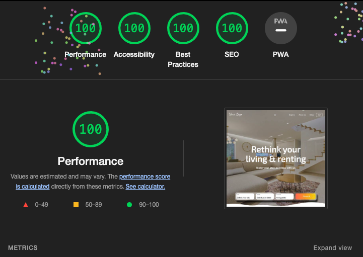
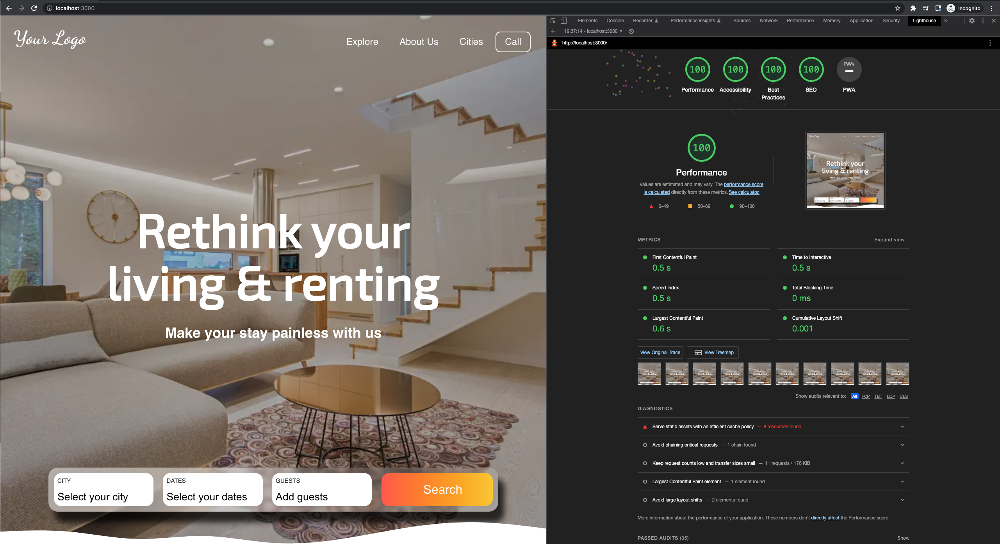
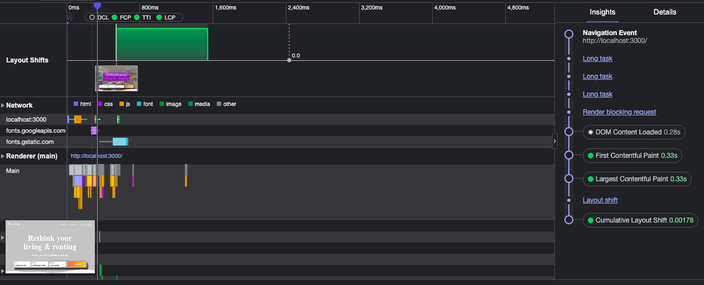

# Rental app

This project was bootstrapped with [Create React App](https://github.com/facebook/create-react-app).

This is illustrates creating a single page in React.js application using [the figma](https://www.figma.com/file/oKN9NbDMHh99WaQXyvAPN9/Rental-website?node-id=0%3A1) wireframe.

## Lighthouse score

## Metrics - FCP, LCP

## Tools or Libraries used

1. React.js
2. SASS for managing styles
3. Cypress for e2e tests

### Todo

1. Currently there are no unit tests are written (due to time limitation, once I get time, will add them)
2. Chosen a single SASS styles bundle instead of scopes styles for individual components as the final bundle size is very less and can be cached apart from js bundles.

## Development

In the project directory, you can run:

### `yarn start`

Runs the app in the development mode.\
Open [http://localhost:3000](http://localhost:3000) to view it in the browser.

### `yarn test`

Launches the test runner in the interactive watch mode.\
See the section about [running tests](https://facebook.github.io/create-react-app/docs/running-tests) for more information.

### `yarn build`

Builds the app for production to the `build` folder.\
It correctly bundles React in production mode and optimizes the build for the best performance.

The build is minified and the filenames include the hashes.

## Deployment

The app is deployed on [surge](https://surge.sh/)
