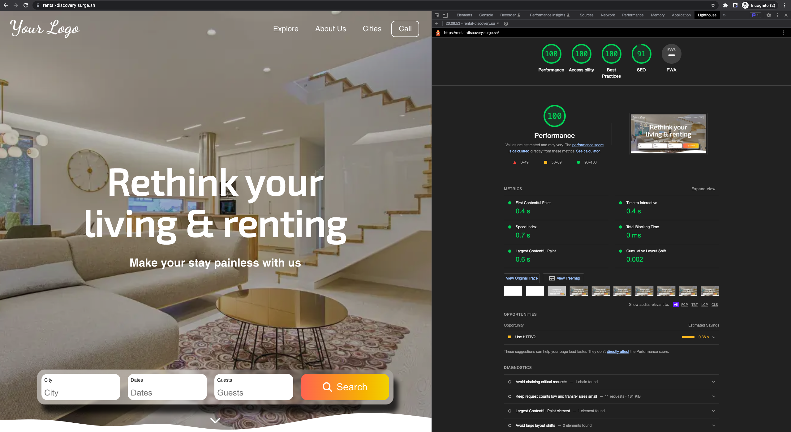
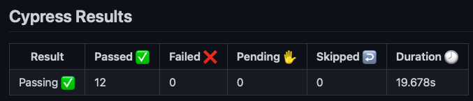

# Rental app

Demo: View live site [here](https://rental-discovery.surge.sh/)

[](https://github.com/lakshmaji/ui-code/actions/workflows/deploy.yml)

[](https://github.com/lakshmaji/ui-code/actions/workflows/e2e.yml)


This project was bootstrapped with [Create React App](https://github.com/facebook/create-react-app).

This is illustrates creating a single page in React.js application using [the figma](https://www.figma.com/file/oKN9NbDMHh99WaQXyvAPN9/Rental-website?node-id=0%3A1) wireframe.

## Lighthouse score

The SEO score is 91. The reason is this is created as an SPA version, so as you guessed the default `robot.txt` wont allow indexing. (I am not ready to modify robots.txt or SEO functionality yet)




## Metrics - FCP, LCP


---

## Tools or Libraries used

1. React.js
2. SASS for managing styles
3. Cypress for e2e tests
4. eslint (prettier) for styling and formatting respectively.

### Todo

1. Add date selection, typeahead search component
2. Currently there are no unit tests are written (due to time limitation, once I get time, will add them)
3. PR workflows can be added
4. There is scope to improve performance
5. Use HTTP/2 protocol

---

## Installation

In the project directory, you can run:

```bash
yarn install
```

## Development

### `yarn start`

Runs the app in the development mode.\
Open [http://localhost:3000](http://localhost:3000) to view it in the browser.

### `yarn e2e`

Launches the test runner (cypress) in the interactive mode.

Cypress (E2E) - CI results


### `yarn build`

Builds the app for production to the `build` folder.\
It correctly bundles React in production mode and optimizes the build for the best performance.

The build is minified and the filenames include the hashes.

## Deployment

The app is deployed on [surge](https://surge.sh/)

## Third part tools for development

1. For cross platform web app verification
   1. https://solisapp.com/
   2. https://sizzy.co/
   3. https://www.browserstack.com/
